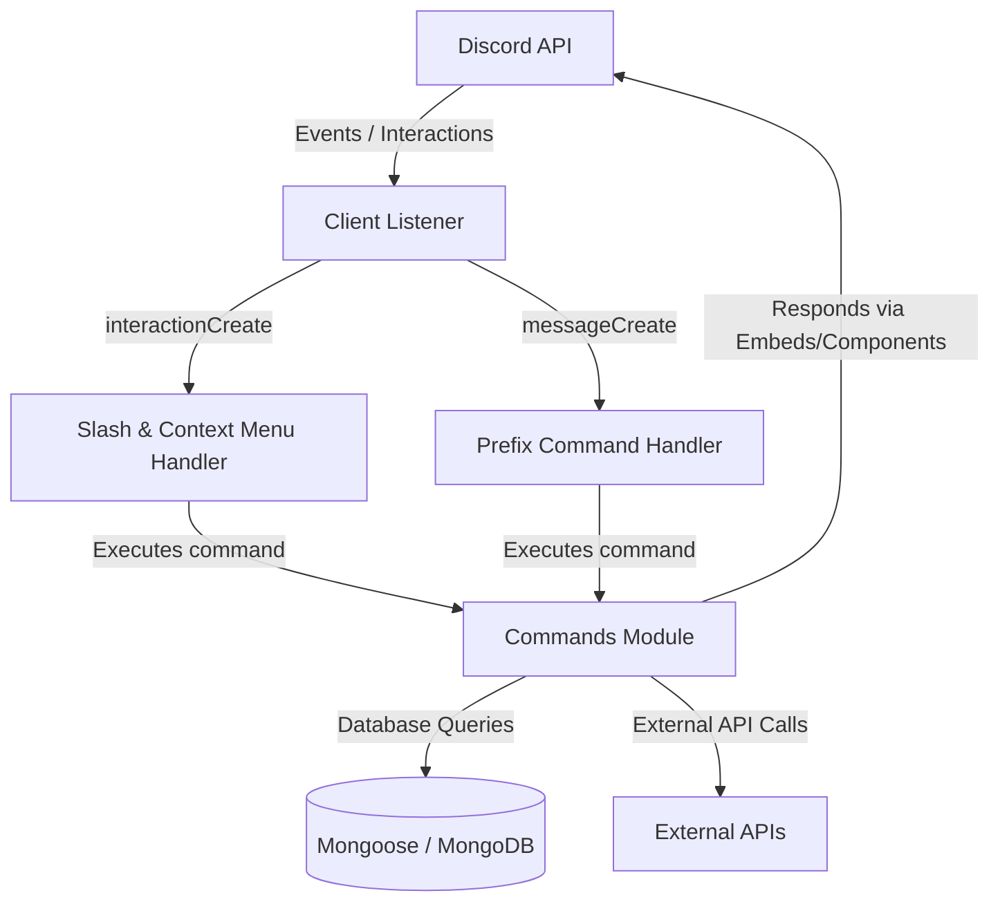

# 🔥 Flame Bot

  <b>A Feature-Rich, Multipurpose Discord Bot with 170+ Prefix and Slash Commands!</b> 
  Built with Discord.js (v13), Node.js, and MongoDB. Includes Giveaways, Economy, Leveling, Server Backup, Reaction Roles, Tickets, AI Chatbot, and more.

## ⚠️ Project was made in 2020

## 📖 Table of Contents
- [📌 Overview](#-overview)
- [🏗️ Architecture](#️-architecture)
- [✨ Core Features](#-core-features)
  - [🛡️ Moderation System](#️-moderation-system)
  - [🎮 Entertainment & Activities](#-entertainment--activities)
  - [🧠 AI & Chatbot Functionality](#-ai--chatbot-functionality)
  - [🌐 API Integration & Locales](#-api-integration--locales)
  - [⚙️ Profile & Custom Commands Config](#️-profile--custom-commands-config)
  - [📥 Server & Role Management](#-server--role-management)
  - [🎟️ Ticket & Suggestion Systems](#️-ticket--suggestion-systems)
- [📦 Database Schemas](#-database-schemas)
- [🚀 Complex Commands & Systems Deep Dive](#-complex-commands--systems-deep-dive)
- [🧠 What I've Learnt Making This Project](#-what-ive-learnt-making-this-project)
- [🛠️ Tech Stack & Dependencies](#️-tech-stack--dependencies)
- [⚡ Installation & Hosting](#-installation--hosting)

---

## 📌 Overview

**Flame Bot** is a high-performance, multipurpose Discord bot designed to provide an all-in-one package for guild management, member engagement, and utility tools. Leveraging the Discord v13 interaction paradigms (including Slash Commands, Context Menus, Select Menus, and Buttons), Flame Bot provides users with a fast, modern, and visually appealing user experience. 

---

## 🏗️ Architecture

Flame Bot operates on a modular architecture divided into four main layers: **Handlers**, **Commands**, **Events**, and the **Database (MongoDB)**.

### Architectural Breakdown:
*   **Command Loader / Handler**: Uses `glob` to scan subdirectories within `commands` and `SlashCommands`, registering commands into a `discord.js` `Collection`. Normal command calls handle aliases, cooldown checks via MongoDB, maintenance toggles, and user/bot permission guards.
*   **Event Loader**: Dynamically requires all JS event modules inside the `events/` folder at startup, hooking them onto the `discord.js` Client.
*   **Database Integration**: Powered by `mongoose`, establishing persistent configurations, profiles, and state machines globally and per-guild.
*   **Slash & Context Menu Execution**: Registers server-specific slash commands for instant guild testing or global registration. Hooks user context menu interactions (like translation) directly to Discord UI menus.

---

## ✨ Core Features

### 🛡️ Moderation System
Flame Bot features robust, command-based and slash-based moderation tools ensuring administrators keep servers clean and secure.
*   **Commands**: `ban`, `kick`, `lock`, `unlock`, `timeout`, `purge`, `slowmode`, `warn`, `remove-warn`, `mute`, `unmute`, and `nuke` (re-creates a channel clean).
*   **Timed Mute Engine**: Safely caches original roles in MongoDB before clearing them, creating a dedicated `Muted` role override on all text channels, and restoring them automatically via a timer.

### 🎮 Entertainment & Activities
*   **Discord Together Games**: Launch internal voice-channel gaming activities like YouTube Watch-Together, Poker, Fishington, Betrayal, Chess, Letter Tile, Word Snack, Spellcast, Awkword, and Doodle Crew using the `discord-together` package.
*   **Fun Commands**: `8ball`, `advice`, `ascii`, `clyde`, `echo`, `emojify`, and `meme` generator.

### 🌐 API Integration & Locales
*   **Context Menu Translator**: Right-click any text message inside Discord to automatically translate it to your user client's local region language using `@iamtraction/google-translate`.
*   **API Integrations**: Uses Axio/Fetch to load up-to-date memes, advice cards, translated packages, and top.gg voting checks.

### ⚙️ Profile & Custom Commands Config
*   Allows members to build a personalized user profile card accessible via `/profile`.
*   **Profile Configurations**:
    *   `/set bio`: Customize your profile bio (keeps lines clean via character splitting).
    *   `/set color`: Update profile embed colors using Hex Codes.
    *   `/set birthday`: Store and display user birthdays.
    *   `/set banner`: Set image background links (validates image formats like `.png`, `.jpg`, `.gif`).
    *   `/set leveling`: Enable or disable the leveling XP system for the guild.

### 📥 Server & Role Management
*   **Auto Roles**: Automatically assigns a configured role to members on join.
*   **Select-Menu Reaction Roles**: Create modern, interactive dropdown lists where users select/toggle their roles without cluttering channels.
*   **Server Backups**: Back up and restore guild channels, permissions, category trees, and base64-encoded server images.

### 🎟️ Ticket & Suggestion Systems
*   **Interactive Ticket Panel**: Configures a category, panel channel, staff role, and transcript logs channel. Members click a button to open a ticket, creating a locked channel with precise permission overrides. Closing a ticket prompts a double confirmation button, generates an HTML transcript of the messages, logs it, and cleans up the channel.
*   **Reputation & Suggestions**: Send suggestions in dedicated channels with auto upvote/downvote buttons. Administrators review and reply using suggestion tokens, updating the embed status and informing the sender in DMs.

---

## 📦 Database Schemas

Flame Bot stores all data structures inside a MongoDB database, mapped out with schemas:
*   [afk.js](models/afk.js): AFK status message, unix timestamp, and member tracking.
*   [Auto Role.js](models/Auto%20Role.js): Guild auto-role configurations.
*   [chatbot.js](models/chatbot.js): Guild chatbot channel mapping.
*   [cmdcooldown.js](models/cmdcooldown.js): Tracks user cooldown states for prefix commands.
*   [keys.js](models/keys.js): Unredeemed premium validation codes.
*   [level.js](models/level.js): Toggle state of the leveling system per guild.
*   [loggingSystem.js](models/loggingSystem.js): Targets channels for logs.
*   [mute.js](models/mute.js): Holds original user roles while muted.
*   [premium.js](models/premium.js): Tracks users with active premium features.
*   [reactionroles.js](models/reactionroles.js): Dropdown choices and mapped roles.
*   [starboard.js](models/starboard.js): Guild starboard configurations.
*   [thank.js](models/thank.js): Users' rep scores.
*   [ticket.js](models/ticket.js): Ticket setups.
*   [User Profile](models/User%20Profile): Birthday, Bio, Color, and Banner models.
*   [Suggestion](models/Suggestion): Suggestion channels and logs mapped to distinct unique tokens.

---

## 🚀 Complex Commands & Systems Deep Dive

### 1. Server Backup Engine (`server-backup.js`)
*   **Path**: [server-backup.js](SlashCommands/serverbackup/server-backup.js)
*   **Complexity**: Connects with `discord-backup` to capture entire server environments. Integrates multi-button verification ("Yes"/"No" double checks) using Discord component collectors. Automatically disables components after use to prevent click spam, exports base64 server graphics, and safely DMs the generated backup ID.

### 2. Auto-Mute Database Synchronization (`mute.js`)
*   **Path**: [mute.js](SlashCommands/moderation/mute.js)
*   **Complexity**: Checks role-hierarchy differences before muting. Generates a custom `Muted` role automatically if it doesn't exist, applying negative permission overrides (`SEND_MESSAGES: false`, `ADD_REACTIONS: false`) globally to all guild channels. Temporarily deposits all current roles in MongoDB, sets a timeout handler, and restores the exact role list even if the bot restarts.

### 3. Context Menu Locale Translation (`translate.js`)
*   **Path**: [translate.js](SlashCommands/context%20menu/translate.js)
*   **Complexity**: Registers as a Discord context action (`MESSAGE` type) instead of a standard slash query. Reads the client's current Discord application language context (`interaction.locale`), parses it to translate codes, translates the fetched message payload automatically, and sends back details of the translation in a colored embed.

### 4. Custom Rank Cards Generator (`rank.js`)
*   **Path**: [rank.js](SlashCommands/leveling/rank.js)
*   **Complexity**: Gathers leveling data from `discord-xp` and computes progress metrics. Feeds these variables into `canvacord` to build custom canvas elements. Rather than static background assets, it picks a random background graphic from a pre-defined neon/cyberpunk asset array, producing unique rank card results.

### 5. Multi-Database Select Menu Leaderboards (`leaderboard.js`)
*   **Path**: [leaderboard.js](SlashCommands/utility/leaderboard.js)
*   **Complexity**: A single command that hosts three distinct data sources (Leveling, Global Economy, and Reputation) behind a Select Menu component collector. It aggregates Mongoose document entries, sorts them dynamically, computes rank pages, fetches user entities from Discord, and updates active embeds on the fly.

### 6. Interactive Suggestion System (`suggestion.js`)
*   **Path**: [suggestion.js](SlashCommands/suggestionsystem/suggestion.js)
*   **Complexity**: Auto-generates a secure 12-character token per suggestion. Fires suggestion embeds to targets and registers voting reaction hooks. Guild moderators use `/suggestion reply [token]` to dynamically update the suggestion's status (e.g. from Pending to Approved/Replied) on the fly, editing the target channel embed and informing the submitter.

### 7. Interactive Ticket System (`ticket.js`)
*   **Path**: [ticket.js](SlashCommands/ticket/ticket.js)
*   **Complexity**: Saves configuration fields (Category, Panel, Staff, Log) to database structures. Button interactions trigger text channel generation. Generates ticket logging files in HTML via `discord-html-transcripts` on ticket closure, sends logs to the moderator logging channel, and deletes the channel automatically.

---

## 🧠 What I've Learnt Making This Project

*   **Asynchronous flow management & JavaScript Promises**: Working with callbacks, event loops, timeouts, and handlers inside a real-time environment.
*   **Working with Discord.js interaction systems**: Shifting from old prefix-based messaging parameters to slash command parameters, buttons, select menus, component collectors, and context actions.
*   **Database Management with MongoDB & Mongoose**: Structuring schemas, caching live channel rules, running queries, updating values, and handling timeouts securely.
*   **Designing Permission-Heavy Scripts**: Restructuring channel permissions for ticket locking and muted overrides while managing client/role hierarchies.

---

## 🛠️ Tech Stack & Dependencies

*   **Runtime Engine**: [Node.js](https://nodejs.org/) (v16.x)
*   **Language**: JavaScript (ES6+)
*   **Library**: [discord.js](https://github.com/discordjs/discord.js) (v13.6.0)
*   **Database Client**: [mongoose](https://github.com/Automattic/mongoose) (v6.0.14)
*   **Graphics rendering**: [canvacord](https://github.com/Devs-Cove/canvacord)
*   **APIs & Utility**: `@iamtraction/google-translate`, `discord-together`, `discord-giveaways`, `discord-backup`, `discord-html-transcripts`, `currency-system`

---